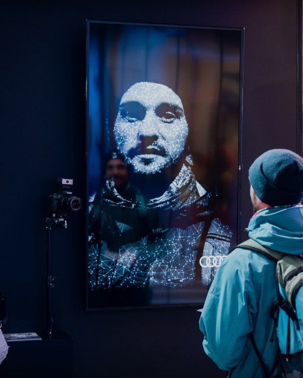
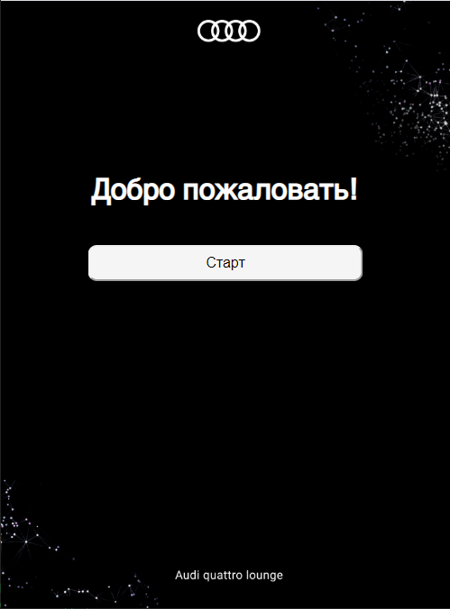
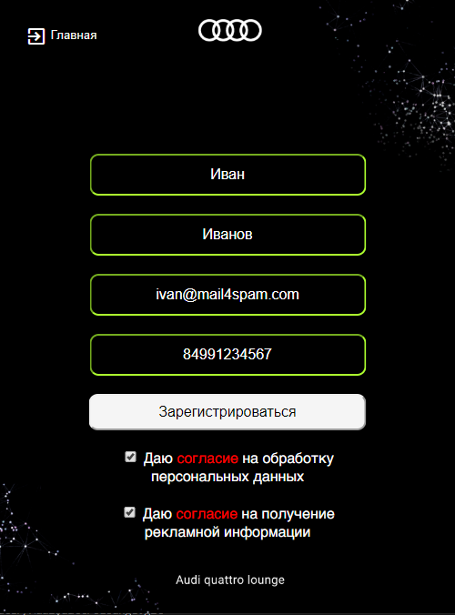
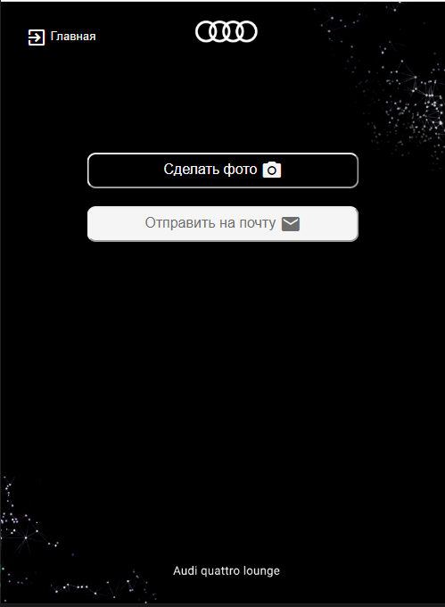
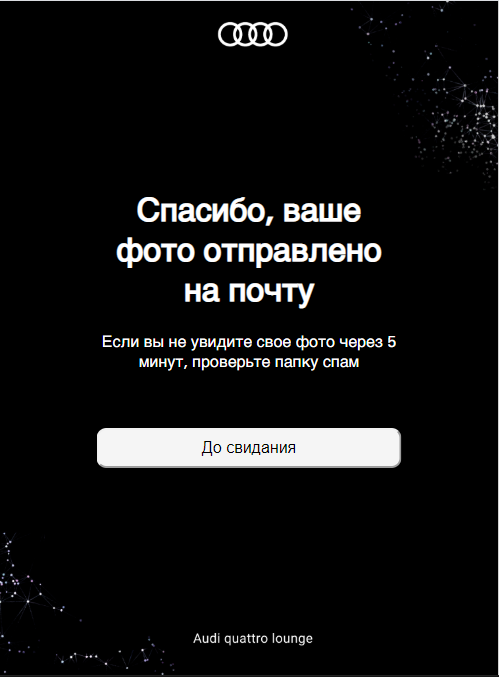

# Веб приложение для управления фотозоной Audi Quattro Lounge

В данном репозитории приведен пример исходного кода веб приложения, написанного для планшета Ipad в рамках проекта Audi Quattro Lounge в красной поляне. Даты работы инсталляции дек-2019 по мар-2020, количество участников за время работы: 1500 человек.

### Функции веб приложения

1. Регистрация новых пользователей
2. Отправка команд на сервер управления фотокамерой
3. Отправка писем с итоговой фотографией на почту гостя
4. Отправка данных об участниках инсталляции на сервер клиента
5. Автоматическое формирование ежедневных и еженедельных отчетов о работе инсталляции

### Скриншоты интерфейса

